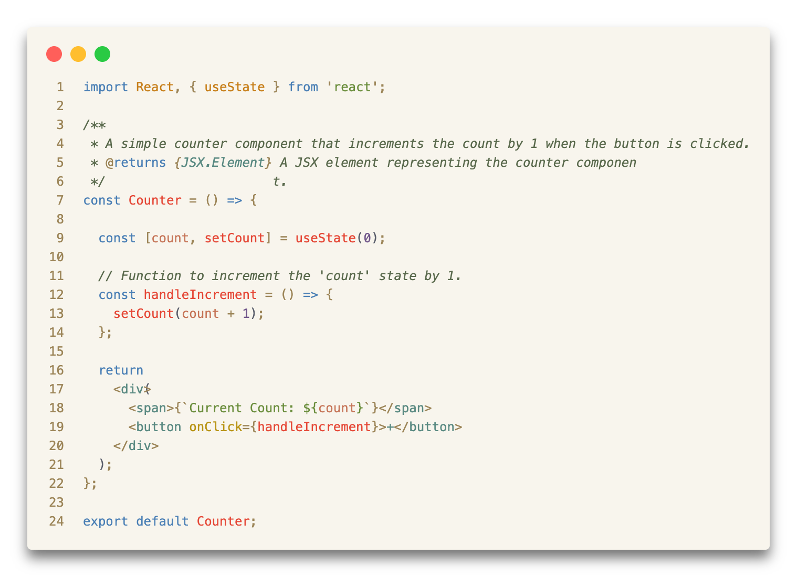
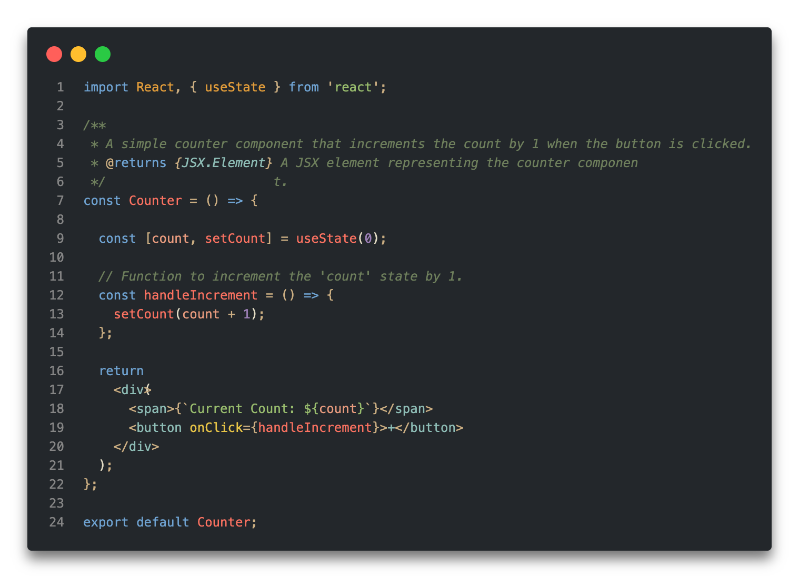

# Nur Theme

  

[Nur](https://nur.fenu.dev) is a color theme designed to provide a pleasant experience for long coding sessions in any programming language.

- Warm, relaxing and accessible color palette
- Markup and Code highlighting optimized for web development
- Light and Dark modes

### Usage
1. Copy the contents of the `themes` directory to the `themes` directory in the [Ghostty configuration directory](https://ghostty.org/docs/config#file-location).
2. Set `theme = nur-ghostty-<mode>.conf` in the [Ghostty configuration file](https://ghostty.org/docs/config#file-location), where `<mode>` is one of `light` or `dark`.
3. Reload configuration from menu or restart Ghostty.

## Platforms

- [Visual Studio Code](https://marketplace.visualstudio.com/items?itemName=michelefenu.nur-theme-vscode)
- [Cursor](https://open-vsx.org/extension/michelefenu/nur-theme-open-vsx)
- [Ghostty](./ghostty/README.md)

## Screenshots

  <table>
    <tr>
      <td align="center">
        <strong>Nur Light</strong> 
        
      </td>
      <td align="center">
        <strong>Nur Dark</strong> 
        
      </td>
    </tr>
  </table>

## Palette and inspirations

Inspired by the vibrant terracotta sunsets, ancient stones, crystal-clear shores, and the rich heritage of the island of Sardinia, this theme offers a warm, relaxing, and accessible visual experience.

### Nur Light

| Uso        | Nome                   | Hex       |
|------------|------------------------|-----------|
| Background | Orbace Chiaro          | #f8f5ed |
| Foreground | Basalto                | #5a5e6b |
| Comment    | Ulivo Profondo         | #5a6a4d |
| Function   | Corallo Vivo           | #e54837 |
| Variable   | Ocra                   | #c77f1a |
| Number     | Cardo Mariano          | #70568a |
| Attribute  | Oro Antico             | #b89415 |
| Keyword    | Turchese Intenso       | #4a7fb5 |
| String     | Macchia Scura          | #6b8e3d |
| Class/Tag  | Laguna Scura           | #5a8a82 |
| Constant   | Terracotta Bruciata    | #c67558 |
| Operator   | Arenaria Scura         | #9c8558 |

### Nur Dark

| Uso        | Nome                 | Hex     |
|------------|----------------------|---------|
| Background | Ossidiana             | #23272b |
| Foreground | Orbace               | #e2dbc4 |
| Comment    | Ulivo                | #6e7f5c |
| Function   | Corallo              | #fc7261 |
| Variable   | Ocra                 | #e19c3a |
| Number     | Lavanda              | #9d80b7 |
| Attribute  | Oro                  | #e8c547 |
| Keyword    | Turchese             | #6fa3d2 |
| String     | Macchia Mediterranea | #98bc6d |
| Class/Tag  | Laguna Chiara        | #8ebdb6 |
| Constant   | Terracotta           | #e89b7e |
| Operator   | Arenaria             | #cbae82 |

## Author

- [Michele Fenu](https://fenu.dev)

## Contributing

Contributions are welcome! Please feel free to submit a pull request or open an issue.

## License

This project is licensed under the MIT License - see the [LICENSE](LICENSE) file for details.

While the license does not require it, I would genuinely appreciate hearing from you if you create derivative works or customizations based on this theme.
